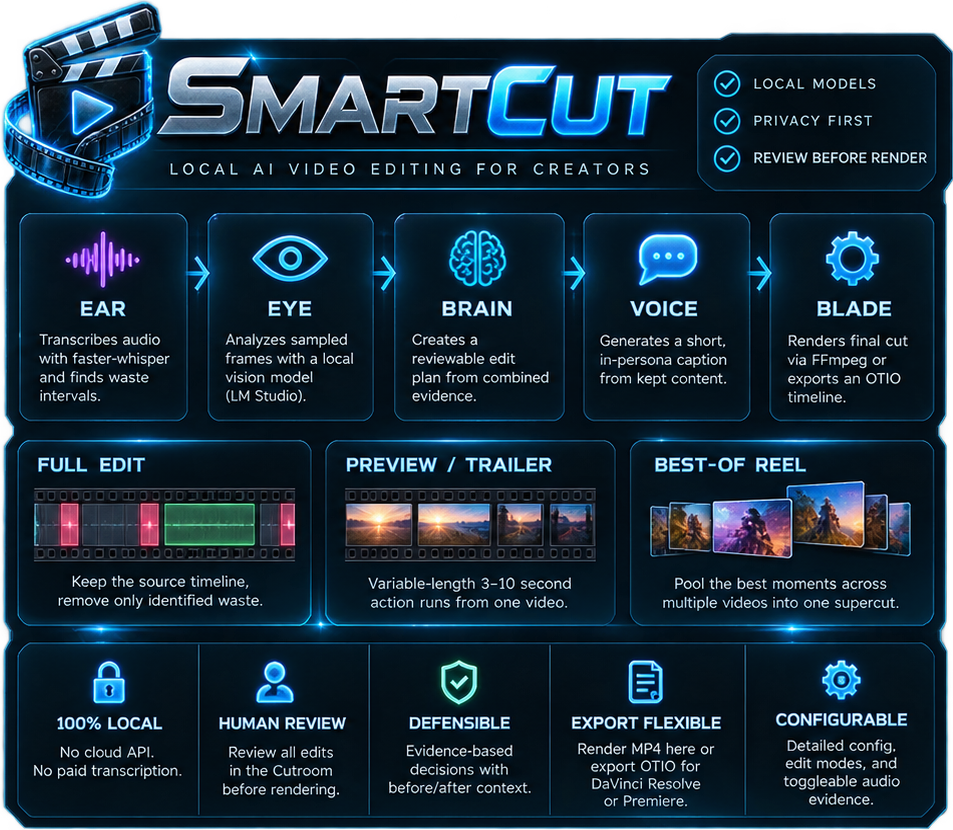

<p align="center">
  
</p>

<p align="center"><b>Local AI video editing for creators.</b><br>
Local models · privacy first · review before render</p>

SmartCut is a local, review-first video editor for creator and performance footage. Point it at raw
video and it transcribes the audio, watches the frames with a local vision model, and proposes a
defensible edit. Then it stops: a human reviews the calls in the **Cutroom** before anything
renders. The finished cut renders to MP4 here, or exports as an OpenTimelineIO, EDL or CSV timeline
that opens in DaVinci Resolve or Premiere for finishing.

## Features

<p align="center">
  
</p>

- **Five-stage pipeline.** Ear transcribes, Eye judges frames, Brain plans, Voice captions, Blade renders.
- **Three edit modes**, chosen explicitly:
  - **Full edit**: keep the source timeline and remove only positively identified waste.
  - **Preview / trailer**: variable-length 3–10 second action runs from one video.
  - **Best-of reel**: pool the strongest moments across several videos into one supercut, with source diversity.
- **100% local.** Transcription, vision, and rendering run on your own hardware. No cloud API, no paid services.
- **Human review.** Every model cut is a proposal you accept or reject; uncertain calls land in a **Needs your eyes** queue.
- **Defensible.** Every cut carries its reason and confidence; every human decision is hash-bound to the exact source.
- **Flexible export.** Render MP4, or export OTIO/EDL/CSV timelines and captions timed to your edit.
- **Configurable.** Every setting is editable in the app, including toggleable audio evidence for music-only footage.
- **Project-based editing.** Create or reopen a project, import media into its asset list, then edit and render without running analysis first.
- **Precise timeline editing.** Full-duration snapped drag previews and live box selection across tracks, with grouped clip edits.
- **Desktop app.** One double-click opens SmartCut in its own window, and closing it stops everything it started.

## Quick start (Windows)

You need:

| Requirement | Why |
| --- | --- |
| Python 3.11+ on `PATH` | Runs the pipeline and the Cutroom server |
| [FFmpeg](https://ffmpeg.org/) (`ffmpeg`, `ffprobe`) on `PATH` | Every probe, thumbnail, waveform and render |
| A vision model behind an OpenAI-compatible API | The Eye. [LM Studio](https://lmstudio.ai/) at `http://127.0.0.1:1234/v1` is the default; any gateway works |
| Microsoft Edge or Google Chrome | The SmartCut app window (optional: the default browser works too) |
| NVIDIA GPU | Optional. Set `whisper_device` to `cuda` for faster transcription |

From the project folder:

```powershell
.\setup.ps1              # creates .venv and installs SmartCut with its web and Whisper extras
.\install-desktop.ps1    # builds SmartCut.exe and puts a SmartCut shortcut on your desktop
```

Double-click **SmartCut** on the desktop. The first launch writes `config.json` from
`config.example.json`, with the `inbox`, `vault` and `work` folders inside the project. Then:

1. Click **New project** in the left panel, name it, and click **Create project**.
   Use **Open…** to resume a saved project or copy an existing edit into a project.
2. **Import media** (or drop files on the Project panel). Files land in `inbox/` and
   become assets of this project. **Add existing media…** reuses files already imported.
3. Drag an asset onto V1/V2 (video or images) or A1/A2 (audio). The dark preview
   shows its full duration and snapped placement. Select an asset to mark a shorter In/Out range.
4. Optionally configure **Pipeline settings** → **Connection**, test the connection, and **Analyze**.
   Review proposals, then use **Auto-edit** or **Sequence → Load approved plan** to apply them.
5. **Render approved cut**, or use **Export** for an OTIO/EDL/CSV timeline or captions.

Projects save their assets and timeline independently under `work/projects/<id>/`; selecting another
asset only changes the Source monitor. Removing an unused asset from a project keeps its original
file. An imported asset stays usable after its original analysis job is cleaned up, including media
outside the configured inbox. A missing file is marked **Offline**; restore it at its saved path
before analyzing it. Analyze only lists available video assets. Pipeline settings are shared across
projects; resolution and frame rate belong to each sequence.

`install-desktop.ps1 -StartMenu` also adds a Start menu entry. If PowerShell blocks the scripts, run
them as `powershell -ExecutionPolicy Bypass -File .\setup.ps1`.

## The desktop launcher

`SmartCut.exe` is a small launcher compiled from `packaging/SmartCut.cs` by the C# compiler that
ships with Windows, so no SDK is needed. It runs `pipeline/launcher.py` with the project's own
`.venv`, which:

- starts the Cutroom server without a console window;
- opens it as an app window in Edge or Chrome, using a dedicated profile in `.smartcut/browser` so
  your theme and editor preferences persist;
- stops the server when you close the window. If there are unsaved edits or a render is still
  running, the window asks before closing.

If SmartCut is already running, a second launch just opens another window on the same server.
Options: `SmartCut.exe --port 8795` uses another port, `SmartCut.exe --browser` uses your default
browser (a small "SmartCut is running" message keeps it alive until you click OK), and the
`SMARTCUT_BROWSER` environment variable picks a specific Chromium-based browser. The server log is
`.smartcut/server.log`.

### Process lifetime

Nothing SmartCut starts may outlive it. On Windows the launcher and the web server each put
themselves in a kill-on-close Job Object (`pipeline/lifecycle.py`). Every process they start
afterwards (the server, FFmpeg and ffprobe, the app window) belongs to that job, so closing the
window, pressing Ctrl+C in `start-web.bat`, a crash, or ending the task in Task Manager all take the
whole tree down. Background tasks run on a daemon thread, so shutdown never waits for a long
analysis to finish. Sequence renders and timeline thumbnails are written to a temporary file and
renamed, so an interrupted job never leaves a truncated file that looks finished. Explorer windows
opened from the app are the one deliberate exception: they stay open.

## How it works

```text
input video
    |
    v
[ Ear ]  local faster-whisper transcript + waste intervals
    |
    +------+
    |      v
    |   [ Eye ]  sampled frames -> local vision model observations
    |      |       (+ OpenCV motion/luminance evidence as context, never as a cut rule)
    |      v
    |   [ Temporal critic ]  bounded candidate windows get before/after inspection
    +------v
       [ Brain ]  manifest + deterministic edit plan
           |      \
           |       -> [ Voice ]  persona caption (transcript + kept observations -> caption.txt)
           v
       [ Blade ]  safe FFmpeg render + verification
           |
           +--> rendered MP4
           +--> .otio / .edl / .csv timeline referencing the original source media
```

- **Ear** (`pipeline/ear.py`): local faster-whisper transcription with word timestamps. Low-confidence
  segments are excluded from caption grounding, so non-verbal audio can't produce fluent hallucinations.
  The first transcription downloads the selected model into the Hugging Face cache (set `HF_HOME` to
  move it).
- **Eye** (`pipeline/eye.py`): samples frames at a configured interval and sends labeled batches to a
  local vision model. It describes what it sees first, then works through the editor's checks (no
  people, technical failure, clothing, take-breakers, banter, intimate content); any matching cut check
  wins, and the verdict must agree with its own description and score. Each frame also carries nearby
  transcript audio, so the model can hear setup talk and banter it can't see. Frame sampling seeks
  straight to timestamps instead of decoding the whole video.
- **Signals** (`pipeline/signals.py`): OpenCV measures motion and luminance at the Eye timestamps into a
  hash-bound `frame_signals.json`. This is evidence for the vision prompt, never an independent cut rule:
  fast movement can be setup *or* the intended reveal.
- **Brain** (`pipeline/brain.py`): owns state, idempotency, stage manifests, and the final edit plan.
  Models provide observations; deterministic planners make bounded decisions. It stops after planning
  so a human can review first.
- **Voice** (`pipeline/voice.py`): writes a short first-person, in-persona social caption from the
  transcript and the observations that survived into the final clips. It runs only when a performer and
  a matching persona are configured.
- **Blade** (`pipeline/blade.py`): the only module that invokes FFmpeg. It renders review clips, burns
  the optional watermark, corrects flagged dark spans, and assembles the final cut. It never touches the
  original source file.

With multi-pass enabled, analysis first writes a `story_map.json` of scene sections and bounded
candidate windows from scene changes plus Eye/Ear evidence; a temporal critic then inspects those
windows with before/after context. Critic cuts stay advisory until the editorial evaluation proves
they're a win.

## Trust the model, verify the uncertainty

The pipeline trusts the vision model's `keep` verdicts: no hidden substring heuristics silently
override them. It doesn't trust its rejections blindly either:

- Confident rejections become waste proposals.
- Every rejection under the confidence threshold becomes a **review interval**: flagged, not cut.
  Nothing uncertain vanishes silently.
- Every disagreement between the model and the heuristics is recorded.

Every observation carries its confidence, and every human decision is written to a hash-bound
`editor_review.json` in source time, so a correction can't silently apply to a different revision of
the footage. **Re-plan with my decisions** rebuilds the plan from those calls before rendering or
exporting.

## The Cutroom

The Cutroom is a compact multitrack editor with persisted project and sequence APIs.
Analysis jobs and source-time review decisions remain separate from each project’s `sequence.json`:

- **Project panel**: New/Open project, project-scoped import and assets, type filters, search,
  list/icon views, offline status, and reel selection. Analysis is optional for importing, editing
  and rendering; the Analyze dialog only offers available project videos.
- **Source and Program monitors**: frame-accurate transport, J/K/L shuttle, a source-time evidence
  minimap, live captions from the transcript, and the AI verdict for the frame under the playhead.
- **Timeline**: V2/V1/A1/A2 tracks with filmstrips and waveforms; AI score/flag and transcript lanes
  that follow the material through your edit; trim, split, ripple, overwrite, linked and snapped moves,
  track mute/lock, markers, and undo/redo with autosave. Drag empty track space to box-select
  intersecting clips across tracks; Shift/Ctrl-click toggles selection. Selected clips move/delete
  together. Drag the ruler to scrub; Escape cancels a drag or selection rectangle.
- **Inspector**: per-clip effects (speed, gain, opacity, scale, position, rotation, fit/fill frame);
  **Review** with the AI summary, the proposal queue, your decisions, nearby evidence and the transcript;
  **Pipeline** with per-stage settings and background tasks.

**Review** turns every model cut proposal into an accept/reject queue (`N` next, `A` accept, `X`
reject, `P` audition with pre-roll). Answers become the same hash-bound Keep/Cut/Protect decisions as
manual ones. **Auto-edit** removes flagged waste, your cut decisions and silences, closes gaps and
adds scene/highlight markers as one undoable step with a dry-run preview; Keep and Protect ranges are
never cut. Rendering always stays explicit. Press `?` in the app for every keyboard shortcut.

The UI follows the OpenEval visual system with Dark, Light and Auto (system) themes; see
[`DESIGN.md`](DESIGN.md).

## Export

| Format | Where | Notes |
| --- | --- | --- |
| MP4 | **Render approved cut** / Export → Rendered MP4 | Rendered by Blade into the output folder |
| OpenTimelineIO (`.otio`) | Export → OpenTimelineIO | References the original media with frame-accurate ranges; opens in Resolve and Premiere |
| EDL (CMX3600) | Export → EDL cut list | Single video track only |
| CSV | Export → CSV edit list | For spreadsheets and logs |
| Captions (`.srt`) | Export → Captions for this edit | Transcript re-timed to your sequence |
| Transcript (`.srt`) | File → Re-transcribe source | Source-timed transcript |

Timeline exports read the current project sequence. Re-plan updates analysis without replacing your
edit; use Auto-edit to apply its cuts, or Load approved plan to replace the timeline (undoable).
Project renders live in `vault/projects/<id>/` and do not overwrite another project’s output.

## Configuration

`config.json` is local state (git-ignored). The first launch creates it from `config.example.json`,
which documents every supported key; everything is also editable under **Pipeline settings**. Keys are
validated on save, and the CLI warns about unknown keys instead of silently ignoring them.

- **Folders**: `input_dir` (import inbox), `output_dir` (renders), `work_dir` (jobs and projects), `analysis_dir`
  (caches). Relative paths are resolved from the working directory; the first-run config writes them as
  absolute paths inside the project.
- **Connection**: `lm_studio_url` (any OpenAI-compatible base URL) and `vision_model`. If the gateway
  needs a key, set it in Pipeline settings or leave it blank to use `NEXUS_LLM_API_KEY` (or
  `NINEROUTER_API_KEY`) from the environment. Keys are sent as a Bearer token and are never returned by
  the API. An empty or missing `/models` endpoint is not treated as a failed connection.
- **`audio_evidence_enabled`** (default `true`): whether speech audio informs edit decisions. When on,
  judged frames carry nearby transcript lines, section summaries see the section transcript, and
  `waste_terms` matches become waste intervals. Turn it off for footage whose soundtrack is music, TV,
  or other non-speech audio: the frame prompt is rebuilt without audio and the model judges purely on
  visuals. Toggling it invalidates the vision cache automatically. It doesn't affect the transcript,
  captions, or the editorial loop's setup-pattern matching.
- **Blade**: `blade_crf`, `blade_preset`, `blade_output_fps`, `transition_seconds`, and the optional
  `watermark_path` and `bumper_path`.
- **Voice**: `performer` and `personas` (performer name → persona instructions) enable captions.

## Other ways to run

**Server console** (development, visible logs): `start-web.bat`, or

```powershell
.venv\Scripts\python.exe -m pipeline.web --config config.json --port 8787
```

then open <http://127.0.0.1:8787>. Ctrl+C stops the server and every job it started.

**Command line**:

```powershell
.venv\Scripts\python.exe run_pipeline.py analyze inbox\clip.mp4           # Ear + Eye + plan, no render
.venv\Scripts\python.exe run_pipeline.py render  inbox\clip.mp4 --auto-plan
.venv\Scripts\python.exe run_pipeline.py preview inbox\clip.mp4 --target-seconds 30
.venv\Scripts\python.exe run_pipeline.py reel    inbox\a.mp4 inbox\b.mp4 --target-seconds 45
.venv\Scripts\python.exe run_pipeline.py watch                               # plan (or render, if auto_render) new inbox files
```

**Docker** (CPU image; CUDA transcription needs the host environment or an NVIDIA container):

```powershell
docker build -f Dockerfile.web -t anna-cutroom .
docker run --rm -p 8787:8787 -v ${PWD}\config.docker.json:/app/config.json -v D:\media:/media anna-cutroom
```

Use container paths (such as `/media/...`) for the folders in the mounted config, and set
`lm_studio_url` to `http://host.docker.internal:1234/v1` (or your gateway's port) to reach a model
server on the host.

## Evaluation

Gold cases score the Eye's raw proposals *before* hash-bound human correction is applied, so a plan
can't get credit for replaying prior review feedback. The labeled corpus covers reveals, real clothing
adjustments, camera setup, blur, dark spans, non-verbal audio, and endings across multiple videos. No
model, prompt, or planner change becomes the default until it improves this report without regressing
protected content. The harnesses live in `tools/`; `docs/qa-runbook-008.md` is the step-by-step QA
runbook for the reference case.

## Development

```powershell
docker build -f Dockerfile.web -t anna-cutroom .
docker run --rm anna-cutroom python -m pytest -q
docker run --rm anna-cutroom node --check frontend/app.js
```

Without Docker, the project venv and Node run the same checks:

```powershell
.venv\Scripts\python.exe -m pytest -q
node --test tests/*.test.mjs
node --check frontend/app.js
```

The frontend is no-build vanilla JavaScript; timeline, auto-edit and theme logic live in Node-tested
`.mjs` modules. All FFmpeg invocations belong in `pipeline/blade.py`.

```text
pipeline/            Ear, Eye, Brain, Voice, Blade, the web API (web.py), launcher and lifecycle
frontend/            the Cutroom: app.js plus Node-tested timeline/auto/theme modules
packaging/           SmartCut.exe source and icon
tests/               pytest and node:test suites
tools/               evaluation and QA harnesses
docs/                QA runbook and README images
run_pipeline.py      command-line entry point
setup.ps1            venv + dependencies
install-desktop.ps1  SmartCut.exe + desktop shortcut
```

## Troubleshooting

- **"SmartCut could not start"**: the message includes the end of `.smartcut/server.log`. A missing
  dependency means `setup.ps1` hasn't run; "address already in use" means another program owns port
  8787 (launch with `SmartCut.exe --port 8795`).
- **"SmartCut is not set up yet"**: run `setup.ps1`, then `install-desktop.ps1`.
- **Speech analysis unavailable / missing faster-whisper**: use the desktop shortcut or the
  project’s `.venv` Python. Web/desktop startup detects a Python without Whisper and uses an existing
  working project environment when available; it never installs packages automatically. Restart an
  already-running server that was launched with the wrong Python. Manual editing remains available.
- **CUDA DLL not found**: Windows CUDA transcription needs cuBLAS for CUDA 12 and cuDNN 9
  ([upstream requirements](https://github.com/SYSTRAN/faster-whisper#gpu)). CUDA 13 DLLs do not
  replace those versions. SmartCut loads existing compatible DLLs from `.smartcut/cuda/` or
  `SMARTCUT_CUDA_DLL_DIR`, adding that folder only to its process's DLL search path and `PATH`.
  It does not download libraries or modify the system environment; CPU/int8 remains available
  in Pipeline settings → Ear.
- **Connection failed**: check the gateway URL and model in Pipeline settings; LM Studio must have the
  server started and the vision model loaded.
- **Analyze or render fails with "required executable is missing: ffmpeg"**: install FFmpeg and add it
  to `PATH`.
- **The window opens in a normal browser tab**: neither Edge nor Chrome was found. Set
  `SMARTCUT_BROWSER` to a Chromium-based browser's `.exe`.

## Philosophy

- **Review-first.** Analysis can run unattended; publishing stays explicit until a measured evaluation
  set says the cut policy is reliable.
- **Uncertainty goes to humans.** The model says what it's unsure about instead of guessing.
- **Deterministic where it counts.** Models observe; planners decide, within bounds.
- **Local.** Transcription, vision, and rendering run on your own hardware. No cloud inference, no paid
  services.
- **Inspectable.** Every cut carries its reason, every decision its hash, every stage its manifest.
